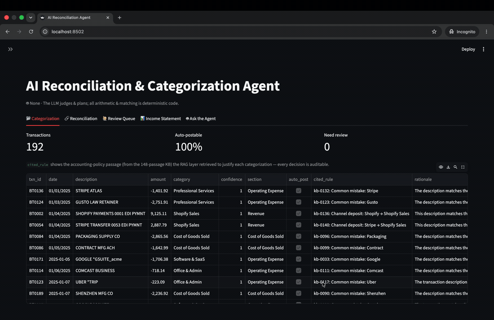

<div align="center">

# 🤖 AI-Powered Financial Reconciliation Agent

### Intelligent transaction categorization. Deterministic financial reconciliation. Fully auditable decisions.

<br/>


<br/>

> ### **The LLM proposes. Deterministic code decides.**

**An AI-assisted system for categorizing messy financial transactions, reconciling payments and settlements, detecting mismatches, and generating an auditable financial trail.**



</div>

---

# 🎯 The Problem

Financial reconciliation looks simple on paper.

```text
Expected Payment  →  ₹10,000

Actual Settlement →  ₹9,750

Difference        →  ❓ Why?
```

But real financial data is messy.

A business may have:

* 🏦 Bank statements with cryptic transaction descriptions
* 🛒 Order or merchant records
* 💳 Payment gateway settlements
* 💰 Processing fees
* ⏳ Delayed settlements
* 🔄 Partial payments
* ⚠️ Duplicate transactions
* 📉 Refunds and deductions
* 📄 Different CSV formats from different platforms

The difficult part isn't just finding that two numbers don't match.

The real challenge is answering:

> **What happened, why did it happen, and can we trust the answer?**

This project solves that problem using a combination of **AI reasoning + deterministic financial logic**.

---

# 🧠 The Core Idea

AI is useful when a system needs to **understand messy information**.

AI is dangerous when it is allowed to **invent financial numbers**.

So this project separates the two.

```text
                    ┌──────────────────────┐
                    │     Messy Data       │
                    │                      │
                    │ FACEBK *7H2K9        │
                    │ AMZN MKTP US         │
                    │ Settlement #2381     │
                    └──────────┬───────────┘
                               │
                               ▼
                  ┌────────────────────────┐
                  │       AI + RAG         │
                  │                        │
                  │ • Understand memo      │
                  │ • Retrieve policy      │
                  │ • Suggest category     │
                  └───────────┬────────────┘
                              │
                              ▼
                  ┌────────────────────────┐
                  │ Deterministic Engine   │
                  │                        │
                  │ • Match transactions   │
                  │ • Calculate fees       │
                  │ • Verify amounts       │
                  │ • Detect mismatches    │
                  └───────────┬────────────┘
                              │
                              ▼
                  ┌────────────────────────┐
                  │   Auditable Results    │
                  │                        │
                  │ ✓ Matched              │
                  │ ⚠ Review Required      │
                  │ ✗ Mismatch             │
                  └────────────────────────┘
```

### The rule is simple:

> **The AI can suggest. The code verifies.**

The LLM never performs critical financial arithmetic.

Every important number is calculated using deterministic Python logic.

This makes the system:

* 🔍 **Auditable**
* 🔁 **Reproducible**
* 🧮 **Mathematically reliable**
* 🤖 **AI-assisted, not AI-dependent**

The original architecture explicitly separates LLM judgment from deterministic reconciliation, with the model used for interpretation while matching and numerical operations remain reproducible.

---

# ⚡ What It Does

The system processes messy financial records and produces structured, explainable results.

```text
INPUT
│
├── Bank Transactions
├── Merchant Orders
├── Payment Settlements
├── Payout Reports
└── Accounting Data
        │
        ▼
AI CATEGORIZATION
│
├── Understand transaction descriptions
├── Retrieve relevant financial rules
└── Assign categories with confidence
        │
        ▼
DETERMINISTIC RECONCILIATION
│
├── Match payments ↔ settlements
├── Calculate expected fees
├── Verify net amounts
├── Handle settlement delays
└── Detect mismatches
        │
        ▼
OUTPUT
│
├── ✅ Matched Transactions
├── ⚠️ Needs Review
├── ❌ Unmatched Transactions
├── 📊 Financial Summary
└── 🔎 Complete Audit Trail
```

---

# 🏦 Razorpay Settlement Use Case

The architecture can be applied directly to payment gateway reconciliation.

For example:

```text
MERCHANT EXPECTATION

Order ID: ORD_1023
Gross Amount: ₹10,000


            │
            │ Payment Gateway
            ▼


SETTLEMENT REPORT

Gross Amount: ₹10,000
Gateway Fee:    ₹200
Tax / Charges:   ₹50

Expected Settlement: ₹9,750


            │
            ▼


BANK ACCOUNT

Amount Received: ₹9,750

                ✅ MATCHED
```

But real-world cases may look like this:

```text
Order Amount         ₹10,000
Expected Settlement   ₹9,750
Actual Settlement     ₹8,750

Difference            ₹1,000
```

Instead of simply reporting:

> ❌ Amount mismatch

The system can classify and investigate the difference:

```text
⚠ PARTIAL SETTLEMENT

Expected: ₹9,750
Received: ₹8,750

Possible reason:
→ Reserve amount withheld

Status:
→ Requires verification
```

The goal is not just **matching numbers**.

The goal is to make reconciliation **explainable**.

---

# 🧱 Architecture

```text
┌─────────────────────────────────────────────────────────────┐
│                        DATA SOURCES                         │
│                                                             │
│  Bank Feed │ Orders │ Payouts │ Settlements │ Accounting    │
└──────────────────────────────┬──────────────────────────────┘
                               │
                               ▼
┌─────────────────────────────────────────────────────────────┐
│                       DATA NORMALIZATION                    │
│                                                             │
│ • Different schemas                                         │
│ • Date formats                                              │
│ • Currency formats                                          │
│ • Amount units                                              │
└──────────────────────────────┬──────────────────────────────┘
                               │
                               ▼
┌─────────────────────────────────────────────────────────────┐
│                     AI CATEGORIZATION                       │
│                                                             │
│              ┌─────────────────────────┐                    │
│              │       LLM Agent         │                    │
│              └────────────┬────────────┘                    │
│                           │                                 │
│                    Retrieve context                         │
│                           │                                 │
│              ┌────────────▼────────────┐                    │
│              │  Knowledge Base (RAG)   │                    │
│              └─────────────────────────┘                    │
└──────────────────────────────┬──────────────────────────────┘
                               │
                               ▼
┌─────────────────────────────────────────────────────────────┐
│                  RECONCILIATION ENGINE                      │
│                                                             │
│  ✓ Amount matching                                          │
│  ✓ Fee calculation                                          │
│  ✓ Settlement window matching                               │
│  ✓ Partial payment detection                                │
│  ✓ Duplicate detection                                      │
│                                                             │
│               🚫 NO LLM USED HERE                           │
└──────────────────────────────┬──────────────────────────────┘
                               │
                               ▼
┌─────────────────────────────────────────────────────────────┐
│                         OUTPUTS                             │
│                                                             │
│  📊 Dashboard                                               │
│  📄 Reconciled Ledger                                       │
│  🔎 Audit Trail                                             │
│  ⚠️ Human Review Queue                                      │
│  📈 Evaluation Metrics                                      │
└─────────────────────────────────────────────────────────────┘
```

---

# 🤖 Where AI Is Actually Used

The system does **not** use AI for everything.

AI is only used where human-like interpretation is useful.

### Example

A bank transaction may look like:

```text
FACEBK *7H2K9
```

A normal matching algorithm cannot easily understand what this means.

The AI agent:

```text
Transaction Memo
        │
        ▼
Retrieve Similar Transactions
        │
        ▼
Retrieve Relevant Policy Rule
        │
        ▼
LLM Interpretation
        │
        ▼
Category: Advertising Expense
Confidence: High
Policy: kb-0054
```

This is where **RAG (Retrieval-Augmented Generation)** helps.

The model doesn't have to guess blindly.

It receives relevant context before making a decision.

---

# 🧮 Where AI Is NOT Used

Financial calculations are always deterministic.

```text
AI ❌
```

is never responsible for:

* Matching financial amounts
* Calculating processing fees
* Calculating net settlements
* Adding totals
* Verifying deposits
* Detecting amount differences

Instead:

```python
expected_settlement = gross_amount - fees - deductions

if actual_settlement == expected_settlement:
    status = "MATCHED"
```

This logic is simple by design.

If the same data enters the system twice:

```text
Same Input
    ↓
Same Code
    ↓
Same Output
```

No randomness.

No hallucinated numbers.

---

# 🔍 The Messiness Is The Point

The system is intentionally designed around messy financial data.

| Problem                     | Example                         | Solution                            |
| --------------------------- | ------------------------------- | ----------------------------------- |
| 🔤 Cryptic transaction memo | `FACEBK *7H2K9`                 | AI + RAG categorization             |
| 💰 Gross vs Net             | ₹10,000 → ₹9,750                | Deterministic fee calculation       |
| ⏳ Settlement delays         | Payment today, settlement later | Date-window matching                |
| 🧩 Partial settlement       | Amount received is lower        | Partial / reserve detection         |
| 🔁 Duplicate transactions   | Same payment twice              | Duplicate detection                 |
| 📄 Different CSV schemas    | Different column names          | Data normalization                  |
| 🔢 Unit mismatch            | Amount stored in cents          | Boundary conversion                 |
| 📅 Date format differences  | `MM/DD/YYYY` vs `YYYY-MM-DD`    | Tolerant parsing                    |
| ❓ Ambiguous transactions    | `AMZN MKTP US`                  | Knowledge-base rules + review queue |

The system does not assume the data is clean.

Because real financial data rarely is.

---

# 🗂️ Project Structure

```text
src/
│
├── schema.py
│   └── Defines the financial categories and data contracts
│
├── generate_data.py
│   └── Generates realistic messy financial data + ground truth
│
├── knowledge_base.py
│   └── Builds the accounting / reconciliation knowledge base
│
├── policy_rag.py
│   └── Retrieves relevant rules for AI decisions
│
├── rag.py
│   └── Retrieves similar historical transactions
│
├── model.py
│   └── LLM provider abstraction
│
├── categorize.py
│   └── AI-powered transaction categorization
│
├── reconcile.py
│   └── Deterministic reconciliation engine
│
├── evaluate.py
│   └── Categorization + reconciliation evaluation
│
├── evaluate_kb.py
│   └── Knowledge-base RAG evaluation
│
└── app.py
    └── Interactive Streamlit dashboard
```

---

# 🚀 Quick Start

Clone the repository and install dependencies:

```bash
git clone <your-repository-url>

cd financial-reconciliation-agent

pip install -r requirements.txt
```

Run the complete pipeline:

```bash
# 1. Generate messy financial data
python src/generate_data.py

# 2. Build the knowledge base
python src/knowledge_base.py

# 3. Run deterministic reconciliation
python src/reconcile.py

# 4. Evaluate categorization + reconciliation
python src/evaluate.py

# 5. Measure knowledge-base RAG impact
python src/evaluate_kb.py

# 6. Launch the dashboard
streamlit run src/app.py
```

---

# 🔑 Running Without an API Key

The project works without any paid AI API.

By default, it can run using an offline mock model for testing and reproducibility.

```text
┌─────────────────────┐
│   No API Key        │
│                     │
│  Offline Mock Model │
│                     │
│  ✔ Free             │
│  ✔ Reproducible     │
│  ✔ Easy to Test     │
└─────────────────────┘
```

To use a real LLM:

```bash
cp .env.example .env
```

Then add:

```env
OPENAI_API_KEY=your_api_key_here
```

The model provider is isolated behind:

```text
src/model.py
```

This makes the LLM layer replaceable without changing the reconciliation engine.

---

# 📊 Evaluation

A financial AI system should not only produce answers.

It should prove whether those answers are correct.

The evaluation pipeline measures:

### 🧠 Categorization Accuracy

```text
Did the system assign the correct category?
```

### 🔍 RAG Impact

```text
How much does retrieval improve the AI's decisions?
```

### 🎯 Confidence-Based Automation

```text
High confidence  → Auto-process
Low confidence   → Human review
```

### 🧮 Reconciliation Accuracy

```text
Did the deterministic engine match
the correct transaction to the correct settlement?
```

---

# 📈 Experimental Results

Using held-out transactions:

| Metric                           |     Result |
| -------------------------------- | ---------: |
| Categorization Accuracy — No RAG |      53.6% |
| Categorization Accuracy — KB RAG |   **100%** |
| Improvement from Retrieval       | **+46.4%** |
| Citation Coverage                |   **100%** |
| Accuracy When Cited              |   **100%** |
| Reconciliation Match Accuracy    |   **100%** |

### The key result

```text
LLM alone
█████████████████████░░░░░░░░░░░░░ 53.6%

LLM + Knowledge Retrieval
████████████████████████████████████ 100%
```

The important lesson is not that:

> **"AI is magically 100% accurate."**

The important lesson is:

> **Giving the model relevant domain knowledge can dramatically improve decisions on ambiguous financial data.**

---

# 👀 Human-in-the-Loop Review

The system does not force AI to make a decision when the evidence is weak.

```text
                    Transaction
                         │
                         ▼
                    AI Decision
                         │
              ┌──────────┴──────────┐
              │                     │
        High Confidence       Low Confidence
              │                     │
              ▼                     ▼
         Auto Process          Needs Review
```

This creates a practical production model:

> **Automate the easy cases. Escalate the uncertain ones.**

Human corrections can later be added back into the knowledge base to improve future decisions.

---

# 🔮 Scaling the RAG Layer

The current system keeps retrieval modular.

Future improvements can include:

### 1️⃣ Hybrid Search

Combine:

```text
BM25 Keyword Search
        +
Vector Similarity Search
```

This works especially well for short financial descriptions containing vendor codes.

---

### 2️⃣ Better Transaction Embeddings

Instead of embedding only:

```text
FACEBK *7H2K9
```

embed structured context:

```text
Merchant: FACEBOOK
Amount Band: ₹5,000–₹10,000
Channel: Bank
Direction: Debit
Memo: FACEBK *7H2K9
```

---

### 3️⃣ Reranking

Retrieve multiple candidate rules:

```text
Top 10 Results
      ↓
Cross-Encoder Reranker
      ↓
Best 3 Rules
      ↓
LLM Decision
```

---

### 4️⃣ Production-Scale Retrieval

Potential options:

```text
FAISS
pgvector
Caching Layer
Hybrid Search
```

The goal is to improve:

* ⚡ Latency
* 💰 Cost
* 🎯 Retrieval quality
* 📈 Accuracy

without changing the main agent logic.

---

# 🛡️ Design Principles

This project follows a few simple principles.

### 1. AI should handle ambiguity

```text
"What does this transaction mean?"
```

### 2. Code should handle arithmetic

```text
"Do these numbers match?"
```

### 3. Every important decision should be traceable

```text
Decision
   ↓
Retrieved Rule
   ↓
Model Output
   ↓
Deterministic Verification
```

### 4. Uncertainty should be visible

```text
High Confidence → Process

Low Confidence  → Review
```

### 5. Evaluation is part of the system

If you cannot measure whether the system works, you cannot safely automate financial decisions.

---

# 🛠️ Tech Stack

| Layer             | Technology                            |
| ----------------- | ------------------------------------- |
| 🐍 Language       | Python                                |
| 🤖 AI             | LLM via provider abstraction          |
| 🧠 Knowledge      | RAG                                   |
| 🔎 Retrieval      | Policy retrieval + transaction memory |
| 🧮 Reconciliation | Deterministic Python                  |
| 📊 Data           | CSV                                   |
| 🖥️ Dashboard     | Streamlit                             |
| 📈 Evaluation     | Custom evaluation pipeline            |
| 🔐 Configuration  | `.env`                                |

---

# ⚠️ Important Caveat

The current knowledge base is generated from the same domain distribution as the evaluation data.

That means retrieval can often find a very similar or near-exact rule.

This is useful for demonstrating and measuring the architecture, but it does **not** mean the system will automatically achieve the same accuracy on completely new merchants, vendors, or financial ecosystems.

A production system would require:

* More diverse real-world data
* Strict train/test separation
* Retrieval quality metrics
* Continuous evaluation
* Human review for uncertain transactions

The goal of this project is to demonstrate the **architecture, evaluation methodology, and design principles** for building trustworthy AI-assisted financial systems.

---

<div align="center">

# 💡 Final Principle

### **Use AI to understand the mess.**

### **Use deterministic code to protect the money.**

<br/>

**If a transaction is ambiguous, ask AI.**
**If a number must be correct, calculate it.**

---

Built as a case-study project exploring **AI + RAG + deterministic systems for financial reconciliation**.

</div>
